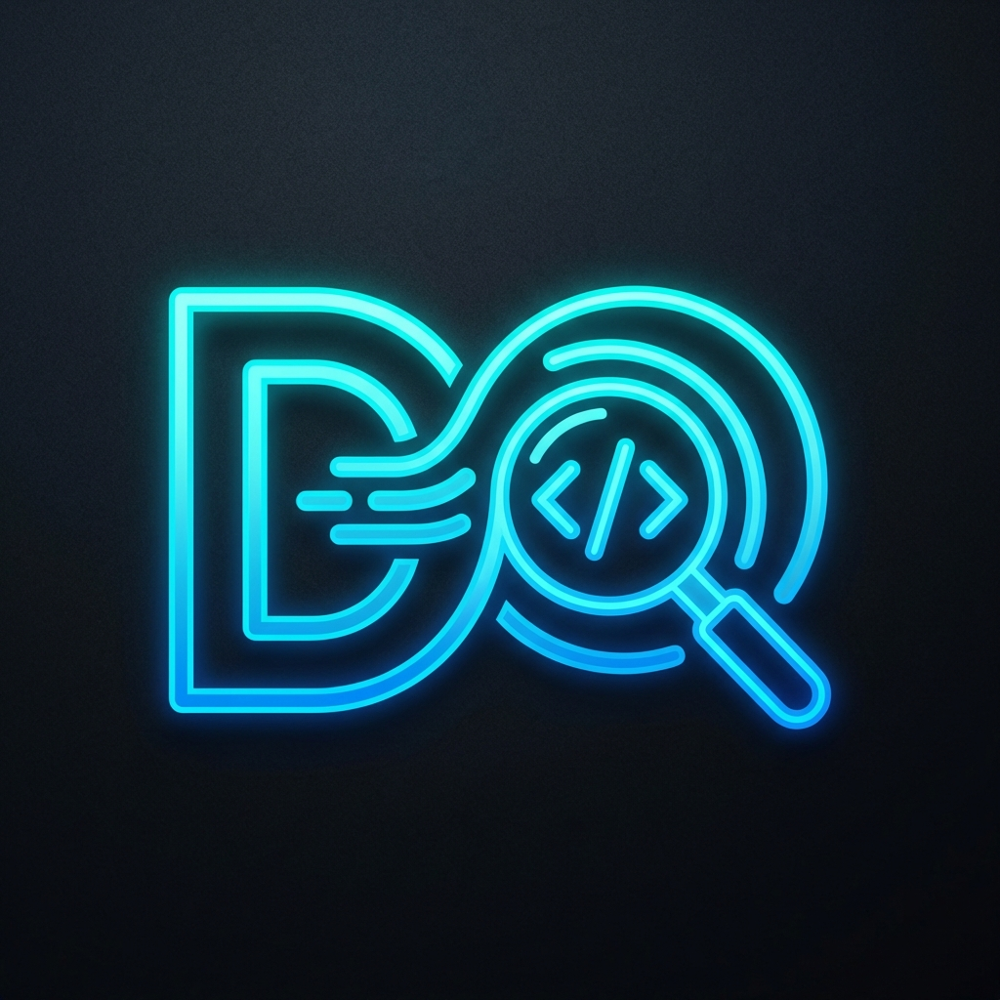

# DevFlow - Deep Visual Debugging Tool 🌊🔍

**DevFlow** is a powerful Chrome Extension that acts as "Shazam for Web Development". It allows you to visually identify the source of any data displayed on a webpage—whether it comes from an API call or internal React Component State—simply by hovering over it.



## 🚀 Features

### 1. 🌐 Smart Network Interception
- **Fetch Proxy**: Automatically hooks into `window.fetch` to capture outgoing requests and incoming JSON responses.
- **Silent Mode**: Intelligently handles CSP (Content Security Policy) and CORS errors to avoid polluting your console.
- **Data History**: Maintains a rolling buffer of recent API calls for real-time matching.

### 2. ⚛️ React "X-Ray" Vision (New!)
- **Component Inspector**: Deeply scans the **React Fiber Tree** under your mouse cursor.
- **State & Props Access**: Identifies if text on the screen comes from a component's `props` or local `state`.
- **Component Names**: Tells you exactly which component (e.g., `<ProductPrice />`) is rendering the text.
- **Fiber Traversal**: Smart matching algorithm walks up the component tree to find the "owner" of the data.

### 3. 🧠 Heuristic Data Matching
- **Reverse Lookup**: Instantly connects UI text (e.g., "$99.00") back to the raw JSON key (e.g., `current_price: 99`).
- **Deep Search**: Recursively searches through nested JSON objects and arrays to find matches.
- **Fuzzy Logic**: Handles basic formatting differences to find the most likely data source.

### 4. 🎨 Non-Intrusive UI
- **Shadow DOM Overlay**: The tooltip lives in a Shadow DOM, meaning it **never** conflicts with the page's existing CSS.
- **Framework Detection**: Auto-detects if the page is running React, Vue, Angular, or Vanilla JS.
- **Neon Aesthetic**: Dark-mode optimized, high-contrast design for easy reading.

### 5. 🛡️ Modern & Secure
- **Manifest V3**: Built on the latest Chrome Extension architecture.
- **Main World Execution**: Uses secure injection techniques to bypass CSP blocking while remaining isolated.

---

## 🛠 Installation Guide

1.  **Download/Clone** this repository to your local machine:
    ```bash
    git clone https://github.com/Mehulbirare/DevFlow.git
    ```
2.  Open **Google Chrome** and navigate to `chrome://extensions/`.
3.  Enable **Developer mode** (toggle in the top right corner).
4.  Click the **Load unpacked** button.
5.  Select the **DevFlow project folder**.
6.  The extension is now active! 🚀

---

## 📖 How to Use

1.  **Navigate** to any dynamic website (e.g., an e-commerce store, social media, or dashboard).
2.  **Wait** for the page to load (DevFlow starts capturing data immediately).
3.  **Hover** your mouse over any text element.
    *   **Blue Tooltip**: Indicates an **API Match** (Data came from a `fetch` request).
    *   **Purple Tooltip**: Indicates a **React Match** (Data came from a Component's Prop or State).
4.  **Read the Tooltip**:
    *   **Key**: The variable name (e.g., `totalAmount`).
    *   **Value**: The raw value (e.g., `4500`).
    *   **Source**: The API URL or Component Name (e.g., `<CartSummary>`).
5.  **Click** the element to log the full matching object to the **Chrome Console** for deep inspection.

---

## ❓ Troubleshooting

**Q: I don't see the tooltip?**
*   Ensure the data came from a `fetch` request or React state *after* the extension was loaded. Try refreshing the page.
*   The matching is case-sensitive for now. If the UI says "Status: Active" and the API says "status: 'active'", it might not match (improving this soon!).

**Q: Does it work on all React apps?**
*   It works best on Development builds, but also works on Production builds of React (Next.js, CRA, Vite) as long as the React DevTools hook is available.

---

## 👨‍💻 Contributing

This is an active Proof-of-Concept. Planned features:
- 📡 WebSocket & XMLHttpRequest Support.
- 💱 Advanced fuzzy matching (dates, currency).
- 📜 "Time Travel" sidebar to see all historical data.

*Built with ❤️ for Developers.*
